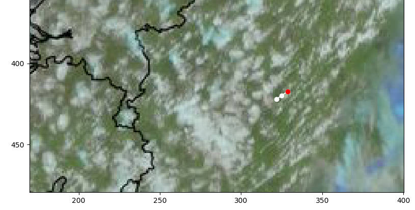

# SubImTrack - Python Package for Subjective Image Tracking

## Introduction
`SubImTrack` is a small python toolbox for subjective tracking of features (e.g. clouds) in a stack of images. It runs i a `ipython`shell and let you 

* interactively load a stack of images
* select cloud track points via Mouse Click in subsequent images
* and store the resulting track data (time identifier, index positions w.r.t image geometry) in a netcdf file

**Why should someone like to track clouds?**

* weather application: 
  * Imagine a developing thunderstorm that brings hazards to the regions where it moves along. It would be really good to monitor such dangerous clouds during their evolution.
* climate science: 
  * Clouds reflect sunlight back to space (They appear white in satellite images). Thus their lifetime might have an impact on the Earths energy balance.

The mentioned examples are best done if automated tracking approaches. However, when rearchers start to develop new approaches they need a high quality test data base. It is where `subimtrack` can be used. 


## Installation
In the following, the steps to install `SubImTrack` are described.

### A dedicated place
It is assumed that your tracking activities start at a dedicated directories, e.g. `tracking`

```bash
mkdir tracking
```

### Via Python Virtual Environment
It is assumed that your python3 installation contains the `venv` module 
(see https://docs.python.org/3/library/venv.html). For installing the 
`subimtrack` package in the separate environment, do: 

* go to your tracking dir
```bash
cd tracking
```
* create a separate python environment and activate it
```bash
python3 -m venv python_env
source python_env/bin/activate
```

* install dependencies
```bash
pip install numpy matplotlib xarray Image
```

* get the repository (good for testing)
```bash
git clone https://github.com/fsenf/SubImTrack.git
```

* locally install it
```bash
cd SubImTrack
pip install --upgrade .
```


## Getting Started
### Prepare for Image Tracking
It is assumed that you prepare images (a temporal sequence with a unique identifier for time in the filename, 
e.g. with the format `%Y%m%d-%H%M`) in a separate folder. 

For testing, the `subimtrack` package provides some Meteosat Images 


## Known Bug
* _Problem_: Resizing the matplotlib window sometimes disconnects the interactive application
  * Don't resize the window
* _Problem_: Exception appears when the end / begin of the image stack is approached several times (E. g. keep going to press <Down Arrow> at the end of the image stack)
